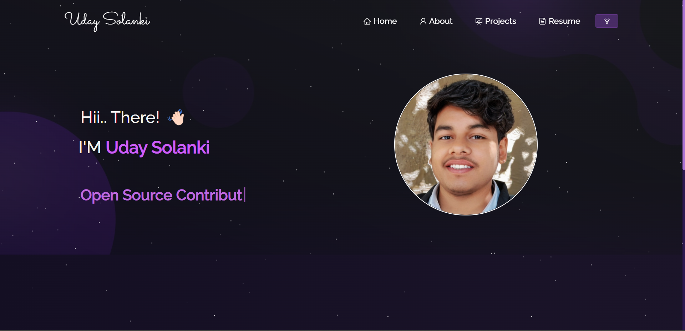
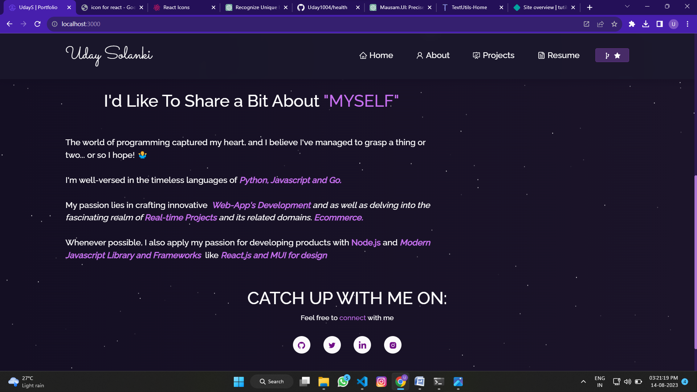

<h2 align="center">
  My Portfolio - v1.0<br/>
  <a href="" target="_blank">UdaySolanki | Portfolio</a>
</h2>
<div align="center">
  
</div>

<br/>

## Demo Images - 



 

<h3 align="center">
    🔹
    <a href="https://github.com/Uday1004/My-Portfolio/issues">Create a Issue</a> &nbsp; &nbsp;
    🔹
    <a href="https://github.com/Uday1004/My-Portfolio/issues">Request for Contribution</a>
</h3>

 ## Live Demo 🌐

Demo 👉 [here]().

<!-- ## Built With

My personal portfolio <a href="https://soumyajit.vercel.app/" target="_blank">soumyajit.tech</a> which features some of my github projects as well as my resume and technical skills.<br/> -->

## Technologies & Tools Used 🛠️

- React.js ⚛️
- HTML 📄
- CSS 🎨
- JavaScript 🚀
- VS Code 🖥️
- Netlify 
- Express.js
 


## Features

**📖 Multi-Page Layout**

**🎨 Styled with React-Bootstrap and Css with easy to customize colors**

**📱 Fully Responsive**

## Installation and Usage 🚀

To use this app locally, follow these steps:

Clone the project

```bash
  [https://github.com/Uday1004/My-Portfolio.git]
```

Go to the project directory

```bash
  cd My-Portfolio.git
```

Install dependencies

```bash
  npm install
```

Start the server

```bash
  npm run start
```

 

Feel free to explore My portfolio for better experience and design ideas | If you have any feedback or suggestions, please let us know. Enjoy! 😊

<a href="mailto:udaysolanki530@gmail.com?">Email-</a>

## Developer
- [Uday solanki](https://www.github.com/Uday1004)

 